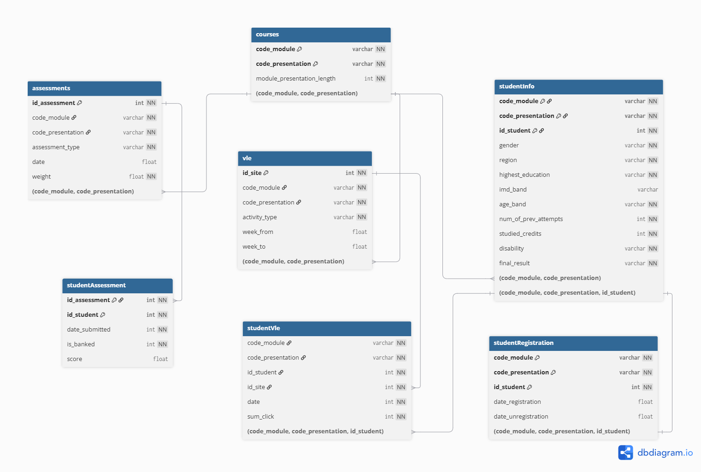

# OULAD Data Warehouse and Business Intelligence

A Data Warehouse and Business Intelligence project based on the **Open University Learning Analytics Dataset (OULAD)**.

This project explores educational data from more than **10 million student VLE interaction records** and builds toward an end-to-end analytical pipeline for understanding student learning behavior and course withdrawal.

## Project Overview

The Open University Learning Analytics Dataset contains information about students, courses, assessments, registrations, and interactions with the Virtual Learning Environment.

The project currently focuses on:

- Exploring and profiling the OULAD source data
- Building a complete data dictionary
- Analyzing missing values and data quality
- Identifying and validating logical keys
- Validating relationships between source tables
- Designing the relational schema
- Defining a Business Intelligence problem
- Preparing the foundation for ODS, Data Warehouse, OLAP, and Power BI development

The main business problem selected for this project is:

> **Analyzing and identifying factors associated with students withdrawing from a course.**

---
## Project Documentation

The detailed report covers the OULAD dataset exploration, data profiling, relational schema, business problem, and analytical requirements.

[View the OULAD Data Analysis and Business Problem Report](docs/report/OULAD_Data_Analysis_and_Business_Problem.docx)
---

## Dataset

The project uses the **Open University Learning Analytics Dataset (OULAD)**.

OULAD contains seven main source tables.

| Table | Rows | Columns | Description |
|---|---:|---:|---|
| `courses` | 22 | 3 | Course modules and their presentations |
| `assessments` | 206 | 6 | Assessments associated with each module |
| `vle` | 6,364 | 6 | Resources and activities in the Virtual Learning Environment |
| `studentInfo` | 32,593 | 12 | Student demographic and academic information |
| `studentRegistration` | 32,593 | 5 | Student registration and withdrawal information |
| `studentAssessment` | 173,912 | 5 | Student assessment submissions and scores |
| `studentVle` | 10,655,280 | 6 | Student interactions with VLE resources |

The largest table is `studentVle`, containing more than **10.6 million interaction records**.

The raw OULAD files are intentionally excluded from this repository because of their size. The dataset can be downloaded separately from the original OULAD source or Kaggle.

---

## Business Problem

The main analytical problem is to investigate factors associated with students **withdrawing from a course**.

In OULAD, a student's final result may include:

- `Distinction`
- `Pass`
- `Fail`
- `Withdrawn`

`Withdrawn` represents a student who withdrew from a particular module or course presentation before completing it. It does not necessarily mean that the student left the university completely.

The analysis combines student characteristics, course registration, assessment performance, and VLE engagement to better understand patterns associated with withdrawal.

The intended users of the future BI system include:

- Lecturers
- Academic advisors
- Education administrators
- Learning analytics teams

---

## Analytical Questions

The Business Intelligence dashboard is designed to answer questions such as:

1. What is the student withdrawal rate across modules and course presentations?

2. How does VLE engagement differ between students with `Withdrawn`, `Pass`, and `Distinction` outcomes?

3. How are assessment scores and submission behavior related to students' final results?

4. Which student groups have higher withdrawal rates based on age, education level, region, and previous attempts?

5. How does student engagement change over time before withdrawal?

---

## Data Profiling

The seven source CSV files are profiled using **Python** and **pandas**.

The profiling process includes:

- Number of rows and columns
- File size
- Data types
- Missing values
- Missing value percentages
- Number of unique values
- Candidate key validation
- Relationship validation
- Referential integrity checks
- Data dictionary generation

The profiling scripts are available in:

```text
scripts/profiling/
```

---

## Data Quality Findings

Several important data quality characteristics were identified during profiling.

| Table | Column | Missing Values | Missing Percentage |
|---|---|---:|---:|
| `assessments` | `date` | 11 | 5.34% |
| `vle` | `week_from` | 5,243 | 82.39% |
| `vle` | `week_to` | 5,243 | 82.39% |
| `studentInfo` | `imd_band` | 1,111 | 3.41% |
| `studentRegistration` | `date_registration` | 45 | 0.14% |
| `studentRegistration` | `date_unregistration` | 22,521 | 69.10% |
| `studentAssessment` | `score` | 173 | 0.10% |

Missing values are not automatically considered data errors.

For example, a missing `date_unregistration` can indicate that the student did not unregister from the module.

---

## Relational Schema
The relationships between the seven OULAD source tables were analyzed and validated against the actual CSV data.

### OULAD Source Relational Schema

The following relational schema represents the relationships identified and validated across the seven OULAD source tables.



The main relationships identified are:

| Parent Table | Child Table | Relationship |
|---|---|---|
| `courses` | `assessments` | 1:N |
| `courses` | `vle` | 1:N |
| `courses` | `studentInfo` | 1:N |
| `assessments` | `studentAssessment` | 1:N |
| `vle` | `studentVle` | 1:N |
| `studentInfo` | `studentVle` | 1:N |
| `studentInfo` | `studentRegistration` | 1:1 |

### Logical Keys

Some OULAD tables require multiple columns to uniquely identify a record.

For example:

```text
courses
(code_module, code_presentation)
```

Neither `code_module` nor `code_presentation` is unique individually. However, their combination uniquely identifies a course presentation in the source data.

The following logical keys were validated against the dataset:

```text
courses
(code_module, code_presentation)

assessments
id_assessment

vle
id_site

studentInfo
(code_module, code_presentation, id_student)

studentRegistration
(code_module, code_presentation, id_student)

studentAssessment
(id_assessment, id_student)
```

These are logical keys identified and validated from the source data. The original CSV files themselves do not contain SQL `PRIMARY KEY` or `FOREIGN KEY` constraints.

---

## Student VLE Interaction Table

The `studentVle` table requires special attention.

A potential key consisting of:

```text
(code_module, code_presentation, id_student, id_site, date)
```

was tested against the source data.

Results:

```text
Total rows:                10,655,280
Unique combinations:        8,459,320
Duplicate combinations:     2,195,960
```

Because duplicate combinations exist, this set of columns cannot be used as a natural primary key.

A surrogate key may be introduced later when designing the Data Warehouse if required.

---

## Generated Data Dictionary

The project automatically generates a data dictionary containing:

- Table name
- Column name
- Detected data type
- Logical key role
- Number of missing values
- Missing percentage
- Number of unique values
- Column description

Generated profiling outputs are stored in:

```text
data/processed/
```

Current generated files include:

```text
dataset_summary.csv
oulad_data_dictionary.csv
oulad_table_summary.csv
```

---

## Project Architecture

The planned analytical architecture is:

```text
OULAD Source Data
        |
        v
       ODS
        |
        v
 Data Warehouse
        |
        v
      OLAP
        |
        v
Business Intelligence
        |
        v
Power BI Dashboard
```

### Source Data

The seven original OULAD CSV files.

### ODS

The Operational Data Store will provide a cleaned and standardized representation of the source data before loading it into the analytical warehouse.

### Data Warehouse

A dimensional model will be designed to support educational analytics.

The warehouse will contain appropriate fact and dimension tables for analyzing students, modules, assessments, VLE engagement, and academic outcomes.

### OLAP

Analytical queries and aggregations will support multidimensional analysis across dimensions such as:

- Module
- Course presentation
- Student characteristics
- Time
- Assessment
- Final result
- VLE activity

### Business Intelligence

Power BI will be used to build interactive dashboards for analyzing course withdrawal, learning engagement, and academic performance.

---

## Repository Structure

```text
OULAD_Project/
|
|-- data/
|   |
|   |-- processed/
|       |-- dataset_summary.csv
|       |-- oulad_data_dictionary.csv
|       |-- oulad_table_summary.csv
|
|-- scripts/
|   |
|   |-- profiling/
|       |-- check_relationships.py
|       |-- create_data_dictionary.py
|       |-- profile_oulad.py
|       |-- verify_erd.py
|
|-- docs/
|   |
|   |-- diagrams/
|   |
|   |-- report/
|
|-- .gitignore
|-- README.md
|-- requirements.txt
```

The raw dataset is stored locally under `data/raw/` but is excluded from Git version control.

---

## Profiling Scripts

### `profile_oulad.py`

Profiles the seven OULAD datasets and analyzes their basic structure.

### `create_data_dictionary.py`

Generates the data dictionary and table summary from the source CSV files.

### `check_relationships.py`

Checks relationships and referential integrity between OULAD tables.

### `verify_erd.py`

Performs additional validation of relationships used in the relational schema.

---

## Technologies

### Current

- Python
- pandas
- Git
- GitHub
- dbdiagram.io

### Planned

- SQL
- Operational Data Store
- Data Warehouse
- Dimensional Modeling
- ETL
- OLAP
- Power BI

---

## Current Progress

### Completed

- OULAD dataset exploration
- Dataset profiling
- Data dictionary generation
- Missing value analysis
- Unique value analysis
- Candidate key validation
- Referential integrity validation
- Relational schema design
- Business problem definition
- Dashboard analytical question definition

### In Progress

- Project documentation
- Data architecture design

### Next Steps

- Design the ODS
- Define data cleaning and transformation rules
- Design the dimensional Data Warehouse
- Define fact and dimension tables
- Implement ETL processes
- Develop analytical SQL queries
- Build the Power BI dashboard
- Analyze course withdrawal patterns

---

## Reproducibility

Install the required Python dependencies:

```bash
pip install -r requirements.txt
```

Place the original OULAD CSV files inside:

```text
data/raw/
```

Then run the profiling scripts from the project root.

Example:

```bash
python scripts/profiling/profile_oulad.py
```

Generate the data dictionary:

```bash
python scripts/profiling/create_data_dictionary.py
```

Validate table relationships:

```bash
python scripts/profiling/check_relationships.py
```

Run additional relational schema validation:

```bash
python scripts/profiling/verify_erd.py
```

---

## Dataset Source

**Open University Learning Analytics Dataset (OULAD)**

The dataset is publicly available through the Open University Learning Analytics Dataset resources and Kaggle.

Raw data is not redistributed in this repository.

---

## Author

**Nong Nhu Uyen**

GitHub: NongNhuUyenn

---

## Project Status

This project is currently under development.

The data exploration, profiling, relational analysis, and business requirement stages have been completed. ODS, Data Warehouse, ETL, OLAP, and Power BI components will be added as the project progresses.